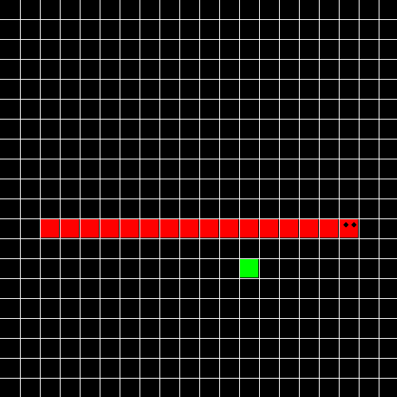

# Snake Game `🐍🎮`
## Descrição
Esse projeto foi desenvolvido a partir de um tutorial no Youtube do canal de tecnologia [freeCodeCamp.org](https://www.youtube.com/@freecodecamp/featured). O projeto utiliza a biblioteca `pygame`, então foi uma ótima oportunidade para aprender um pouco sobre ela.

## Tela de jogo

  
## Tecnologias Utilizadas
Linguagem de programação: Python  

## Projeto Original
[Snake - Tutorial from Tech with Tim](https://youtu.be/XGf2GcyHPhc?si=rhZk_stH4SxcSkC7&t=2739)

# Autor
Pedro Henrique Sales dos Santos  
Email: pedrosales2806@gmail.com
